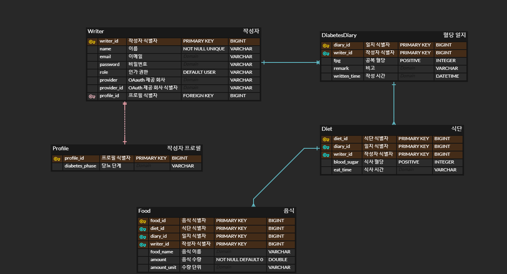

# __Diabetes Diary API Remake__

## 버전 : 1.0.7

### 웹 사이트 주소 ###

https://www.diabetes-diary.tk/

### 블로그 주소

https://velog.io/@dasd412/series/%ED%8F%AC%ED%8A%B8%ED%8F%B4%EB%A6%AC%EC%98%A4

### 주요 기능 (작성 예정)

### API end point (작성 예정)

### 디렉토리 구조 [대부분의 DTO 제외]

+ Backend
    + https://github.com/dasd412/RemakeDiabetesDiaryAPI/wiki/%EB%B0%B1-%EC%97%94%EB%93%9C-%EB%94%94%EB%A0%89%ED%86%A0%EB%A6%AC
+ Frontend
    + https://github.com/dasd412/RemakeDiabetesDiaryAPI/wiki/%ED%94%84%EB%A1%A0%ED%8A%B8-%EC%97%94%EB%93%9C-%EB%94%94%EB%A0%89%ED%86%A0%EB%A6%AC

### 다이어그램 (작성 예정)

+ ERD
  
+ 서비스 흐름도
+ 배포 다이어그램

### 진행 상황 ###

+ 데이터 재설계 및 JPA 적용
    + DB 스키마 재설계
    + JPA 연관관계 재맵핑
    + JPA Repository 테스트 코드 작성 및 수행
    + 서비스 레이어 생성
    + JPQL @Query 코드 제거 후, QueryDSL 적용. 기존 테스트를 수행하여 정상 작동하는 지 확인하며 진행
    + 컨트롤러 레이어 생성
    + MockMvc 를 활용하여 컨트롤러 레이어 테스트 수행
    + n+1 문제 최적화 수행
    + 삭제 연산 최적화 수행 [벌크 연산 처리]
    + MySql 연동 완료
    + 삽입 연산 최적화 수행
    + 음식 엔티티에 수량 단위 추가 [요구사항 반영]

+ 스프링 시큐리티
    + 일반 회원가입과 로그인 구현
    + OAuth 로그인 및 회원 가입 구현
    + 기존 도메인 테스트에 스프링 시큐리티 적용 [관리자만 접근 가능하도록 변경]
    + 도메인 컨트롤러 매핑 url 에서 작성자 정보 제거하고 세션으로 판단하기
    + 아이디 찾기 , 비밀번호 찾기 구현(예정, 기존 이메일 서비스 활용할 듯.)
    +  시큐어 코딩(예정)

+ 뷰
    + 공통 메뉴 레이아웃 추가
    + 로그인 폼 추가
    + 회원 가입 폼 추가
    + 작성용 폼 생성 및 ajax 로직 추가
    + 수정 / 삭제용 폼 생성 및 ajax 로직 추가
    + 달력과 연동
    + 검색기능 만들고 그 결과로 차트 생성하기
    + 작성용 폼 더 이쁘게 만들기
    + 음식 검색 게시판 만들기

+ 배포
    + amazon ec2 인스턴스 생성
    + amazon rds 생성 및 연동
    + aws 내에 jar 배포 완료
    + Freenom 과 aws route 53으로 무료 도메인 얻음.
    + acm 에서 무료 ssl 발급 받음
    + 사이트에 https 적용
    + oauth 로그인 리디렉션 url 변경 (크롬 브라우저 등에서 피싱 사이트 의심 발생. 조치 필요.)
    + travis ci 와 code deploy 를 활용하여 배포 자동화 [master branch 푸시하면 자동 배포됨.]

+ 문서화
    + Readme
    + 코드 내 주석 처리 [JavaDoc 기준]
    + 다이어그램 작성 및 게시
    + dto에 swagger 입히기 (예정)

### 테스트 커버리지 ###

+ (2022-02-13 전체 패키지 기준)
    + 테스트 총 154개
    + 클래스 커버리지 94% (103/109)
    + 메소드 커버리지 74% (500/671)
    + 라인 커버리지 75% (1583/2101)

+ (2022-02-13 domain 패키지 기준)
    + 테스트 총 86개
    + 클래스 커버리지 100% (22/22)
    + 메소드 커버리지 84% (134/159)
    + 라인 커버리지 86% (502/581)

+ (2022-02-04 controller 패키지 기준)
    + 테스트 총 49개
    + 클래스 커버리지 96% (28/29)
    + 메소드 커버리지 85% (156/182)
    + 라인 커버리지 74% (358/483)

+ (2022-02-13 security 패키지 기준)
    + 테스트 총 19개
    + 클래스 커버리지 93% (30/32)
    + 메소드 커버리지 63% (130/206)
    + 라인 커버리지 64% (385/595)

### 개선 사항

+ 복합키의 장점을 못 살렸음.
+ Nginx 무중단 배포 실패. (아마 elb와 충돌한 것 같다.)
+ JQuery 코드 사용 중지하고 React로 리팩토링 필요
+ Travis ci 로그 길이 제한 때문에 -DskipTests를 사용하고 있다. 테스트를 실행하게 할 수 있는 방법이 없을까.

### 사용 기술

+ SpringBoot
+ JPA
+ Querydsl
+ MySql
+ Spring Security
+ Junit
+ Mustache, css
+ JQuery [배포 후 React 로 리팩토링 예정. ajax는 axios로 바꿀 예정.]
+ AWS (ec2, route 53, ACM, rds, code deploy )
+ travis ci

### 사용 라이브러리

+ chart.js
+ datepicker.js
+ bootstrap

### 본인 작성이 아닌 것.

+ /resources/static/vendor/* [colorLib 저작권 ]
+ /resources/static/sidebar-07/* [colorLib 저작권 ]
+ /resources/static/js/calendar/ (calendar.js ,formatter.js, stringBuffer.js) [구글링 코드]
+ src/main/java/com/dasd412/remake/api/controller/security/domain_view/FoodPageMaker [스타트 스프링 부트]

