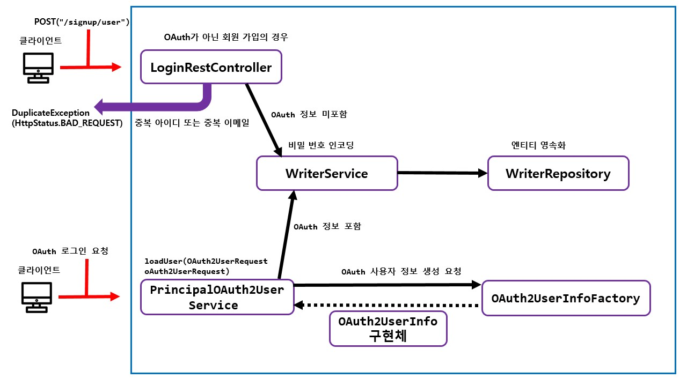
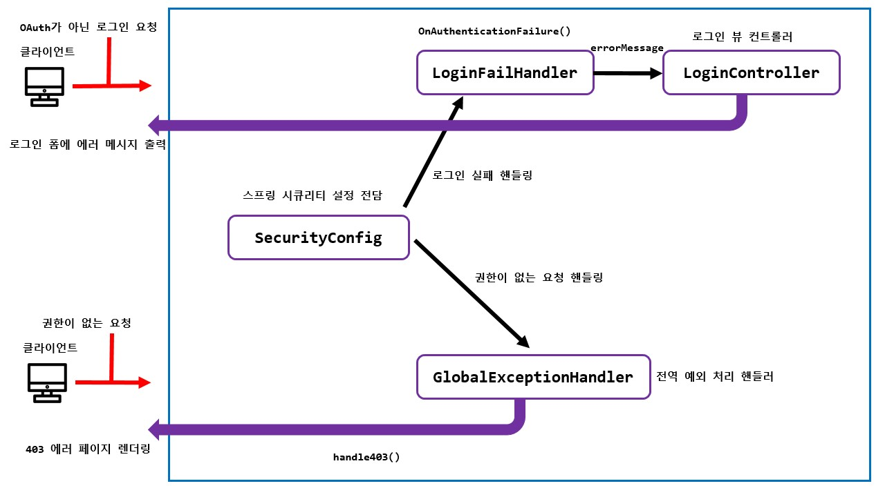
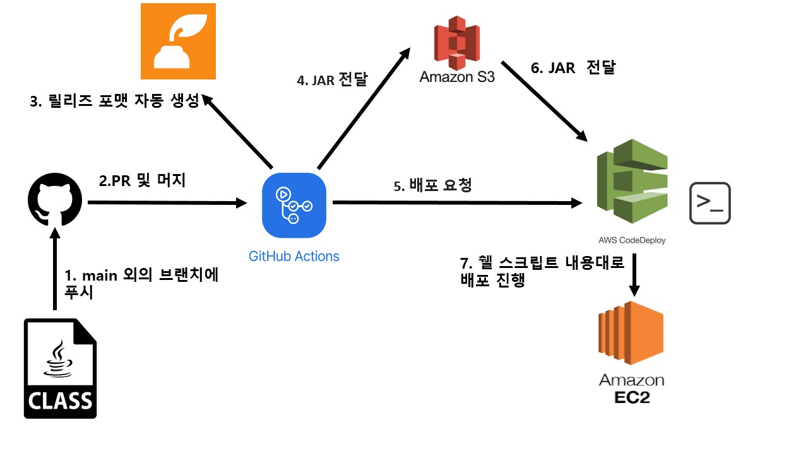
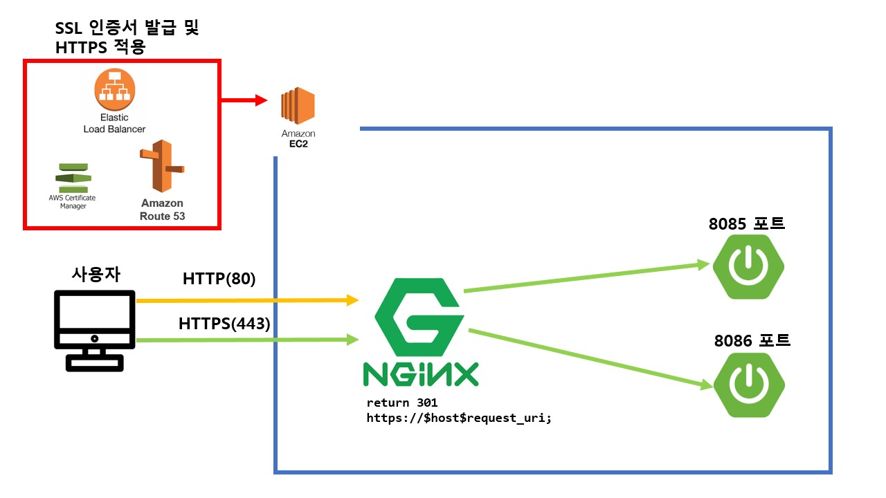
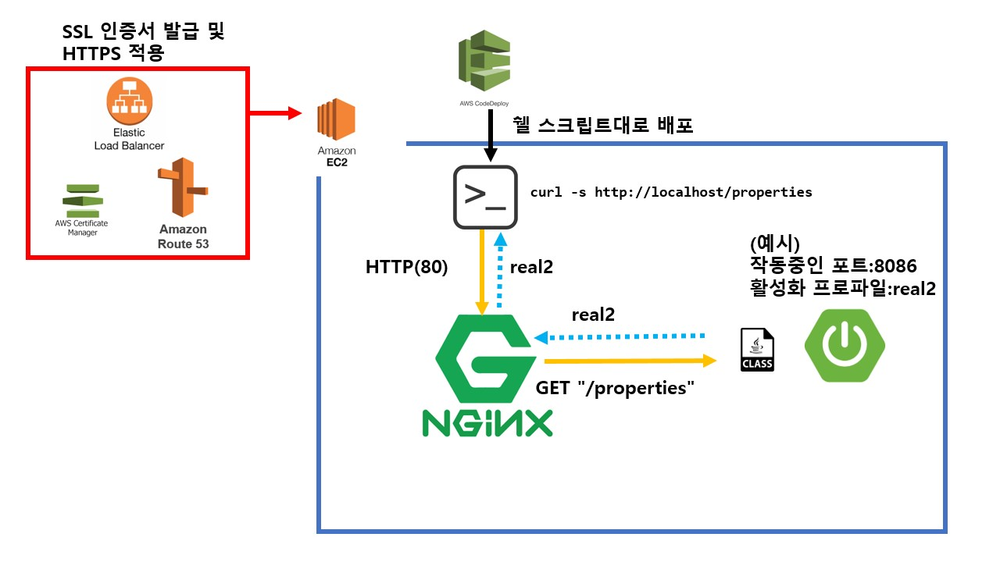

# __Diabetes Diary API Remake__

## 버전 : 1.2.0

***

### 웹 사이트 주소 ###
**크롬 브라우저 검수가 아직 안되었습니다. 다른 브라우저로 접속해주세요!**

https://www.diabetes-diary.tk/

### 블로그 주소 

**제가 어떻게 코드를 설계했고 버그를 해결했는 지 확인할 수 있습니다.**

https://velog.io/@dasd412/series/%ED%8F%AC%ED%8A%B8%ED%8F%B4%EB%A6%AC%EC%98%A4
***

### 주요 기능

1. 회원 가입 ✅
2. 로그인 (form login과 OAuth login 방식 모두 제공) ✅
3. 일지 작성 및 수정 / 삭제 기능 ✅
4. 달력으로 일지 표시 ✅
5. 공복 혈당 / 식사 혈당/ 평균 혈당 관련 차트 ✅
6. 음식 검색 게시판 ✅
7. 프로필 및 회원 탈퇴 ✅
8. 아이디 ,비밀 번호 찾기 ✅
9. 임시 저장 기능 구현 (예정)
10. JWT 적용(예정)

***
### 사용 기술

+ SpringBoot
+ JPA
+ MySql
+ Spring Security
+ Junit
+ Mustache, css
+ AWS (ec2, route 53, ACM, rds, code deploy )
+ travis ci [trial plan 만료로 인해 사용 중지]
+ github actions
+ Nginx

### 사용 라이브러리
+ JavaMail
+ Querydsl
+ chart.js
+ JQuery
+ datepicker.js
+ bootstrap

***

### 테스트 커버리지 ###

+ (2022-03-06 전체 패키지 기준)
  + 테스트 총 175개
  + 클래스 커버리지 93% (128/137)
  + 메소드 커버리지 75% (575/765)
  + 라인 커버리지 74% (1783/2378)

+ (2022-03-06 domain 패키지 기준)
  + 테스트 총 99개
  + 클래스 커버리지 100% (27/27)
  + 메소드 커버리지 85% (160/187)
  + 라인 커버리지 84% (523/622)

+ (2022-03-06 controller 패키지 기준)
  + 테스트 총 76개
  + 클래스 커버리지 93% (80/86)
  + 메소드 커버리지 72% (331/459)
  + 라인 커버리지 68% (846/1243)

***

### 본인 코드 작성 예시 및 설명
+ [1:N 관계 엔티티 save시 update 쿼리가 추가로 발생 및 전파되는 이슈 해결](https://velog.io/@dasd412/1.%EB%8D%B0%EC%9D%B4%ED%84%B0-%EB%B0%8F-%EA%B5%AC%EC%A1%B0-%EC%84%A4%EA%B3%84-1N-%EA%B4%80%EA%B3%84-%EC%97%94%ED%8B%B0%ED%8B%B0-save%EC%8B%9C-update-%EC%BF%BC%EB%A6%AC%EA%B0%80-%EC%B6%94%EA%B0%80%EB%A1%9C-%EB%B0%9C%EC%83%9D%ED%95%98%EB%8A%94-%EC%9D%B4%EC%8A%88-%ED%95%B4%EA%B2%B0)
+ [JPA 및 Querydsl 사용 경험 정리](https://github.com/dasd412/interview_note_for_myself/blob/master/JPA/JPA%20%EC%82%AC%EC%9A%A9%20%EA%B2%BD%ED%97%98%20%EC%A0%95%EB%A6%AC.md)
+ [도메인 테스트 코드 작성하기](https://github.com/dasd412/interview_note_for_myself/blob/master/TestCode/%EB%8F%84%EB%A9%94%EC%9D%B8%20%ED%85%8C%EC%8A%A4%ED%8A%B8.md)
+ [컨트롤러 레이어 테스트 코드 작성하기](https://github.com/dasd412/interview_note_for_myself/blob/master/TestCode/%EC%BB%A8%ED%8A%B8%EB%A1%A4%EB%9F%AC%20%ED%85%8C%EC%8A%A4%ED%8A%B8.md)
+ [오타에서 안전한 코드 만들기](https://github.com/dasd412/interview_note_for_myself/blob/master/CodeDesign/%EC%98%A4%ED%83%80%EC%97%90%EC%84%9C%20%EC%95%88%EC%A0%84%ED%95%9C%20%EC%BD%94%EB%93%9C%20%EB%A7%8C%EB%93%A4%EA%B8%B0.md)
+ [예외 처리](https://github.com/dasd412/interview_note_for_myself/blob/master/Java/%EC%98%88%EC%99%B8%20%EC%B2%98%EB%A6%AC.md)
+ [스프링 시큐리티 적용하기](https://velog.io/@dasd412/2.%EC%8A%A4%ED%94%84%EB%A7%81-%EC%8B%9C%ED%81%90%EB%A6%AC%ED%8B%B0%ED%9A%8C%EC%9B%90%EA%B0%80%EC%9E%85-%EB%A7%8C%EB%93%A4%EA%B8%B0)
+ [일지 기능 구현하기](https://velog.io/@dasd412/3.%EA%B8%B0%EB%B3%B8-%EA%B8%B0%EB%8A%A5-%EA%B5%AC%ED%98%84%ED%95%98%EA%B8%B0-%EC%9D%BC%EC%A7%80-%EC%9E%91%EC%84%B1%ED%95%98%EA%B8%B0)
+ [배포](https://velog.io/@dasd412/4.-%EB%B0%B0%ED%8F%AC%ED%95%98%EA%B8%B0maven-%ED%94%8C%EB%9F%AC%EA%B7%B8%EC%9D%B8-%EC%B6%94%EA%B0%80)
+ [음식 게시판 페이징 처리하기](https://github.com/dasd412/RemakeDiabetesDiaryAPI/issues/48)
+ [Querydsl BooleanBuilder로 중복 코드 제거하기 리팩토링](https://github.com/dasd412/RemakeDiabetesDiaryAPI/issues/51)
+ [JPA batch insert 실험하기](https://velog.io/@dasd412/JPA-Save-%EC%B5%9C%EC%A0%81%ED%99%94-%EC%8B%A4%ED%97%98-batch-insert)
+ [save, update 성능  40% 향상 ](https://velog.io/@dasd412/%ED%8A%B8%EB%9E%9C%EC%9E%AD%EC%85%98%EC%9C%BC%EB%A1%9C-%EC%84%B1%EB%8A%A5-%EC%B5%9C%EC%A0%81%ED%99%94%ED%95%98%EA%B8%B0)
+ [HTTPS 적용된 것을 Nginx로 무중단 배포해보자.](https://velog.io/@dasd412/Nginx-%EC%9E%AC%EC%8B%9C%EB%8F%84)
***
### API end point

#### Controller

+ IndexController
    + ` GET "/" ` -> 대문 화면
    + ` GET "" `  -> 대문 화면

+ LoginController
    + `GET "/login-form" `
    + `GET "/join-form" `

+ CalendarFormController
    + `GET "/calendar" `

+ ChartFormController
    + `GET "/chart-menu" `
    + `GET "/chart-menu/chart/fasting-plasma-glucose" `
    + `GET "/chart-menu/chart/blood-sugar" `
    + `GET "/chart-menu/chart/average" `
    + `GET "/chart-menu/chart/food-board/list" `

+ DiaryFormController
    + `GET "/post" `
    + `GET "/update-delete/{diaryId}" `
    + `GET "/update-delete/404" ` [circular view path 해결용]

+ ProfileController
    + `GET "/profile/view`

#### REST Controller

+ LoginRestController
    + `POST "/signup/user" `

+ SecurityDiaryRestController
    + `POST "/api/diary/user/diabetes-diary" `
    + `PUT "/api/diary/user/diabetes-diary" `
    + `DELETE "/api/diary/user/diabetes-diary/{diaryId}" `
    + `GET "/api/diary/user/diabetes-diary/list" `

+ SecurityChartRestController
    + `GET "/chart-menu/fasting-plasma-glucose/all" `
    + `GET "/chart-menu/fasting-plasma-glucose/between" `
    + `GET "/chart-menu/blood-sugar/all" `
    + `GET "/chart-menu/blood-sugar/between" `
    + `GET "/chart-menu/average/all" `
    + `GET "/chart-menu/average/between" `

+ ProfileRestController
    + `PUT "/profile/info"`
    + `DELETE /profile/withdrawal"`[회원 탈퇴]
    + `PUT "/profile/password"` [비밀 번호 변경]

+ FindInfoRestController
  + `GET "/user-info/user-name"`
  + `GET "/user-info/password"`

***

### 디렉토리 구조

+ Backend
    + https://github.com/dasd412/RemakeDiabetesDiaryAPI/wiki/backend-directory
+ Frontend
    + https://github.com/dasd412/RemakeDiabetesDiaryAPI/wiki/frontend-directory

***

### 다이어그램

+ ERD

  

+ 회원 가입 

  
  
+ 시큐리티 관련 예외처리

  

+ 로그인  

  

+ 배포 다이어그램

  

+ 무중단 운영 다이어그램

  

+ 쉘 스크립트 요청 캐치 예시

***

### 진행 상황 ###
+ 데이터 재설계 및 JPA 적용
    + DB 스키마 재설계
    + JPA 연관관계 재맵핑
    + JPA Repository 테스트 코드 작성 및 수행
    + 서비스 레이어 생성
    + JPQL @Query 코드 제거 후, QueryDSL 적용. 기존 테스트를 수행하여 정상 작동하는 지 확인하며 진행
    + 컨트롤러 레이어 생성
    + MockMvc 를 활용하여 컨트롤러 레이어 테스트 수행
    + n+1 문제 최적화 수행
    + 삭제 연산 최적화 수행 [벌크 연산 처리]
    + MySql 연동 완료
    + 삽입 연산 최적화 수행
    + 음식 엔티티에 수량 단위 추가 [요구사항 반영]
    + 중복 QueryDSL 코드 BooleanBuilder로 리팩토링. [BooleanBuider를 활용한 동적 쿼리 생성]
    + 프로필 엔티티 추가 및 작성자 엔티티와 1대1 관계 구성
    + 엔티티 저장 및 수정 코드 최적화 수행 [약 40% 향상]
    + 일지 내용 임시 저장 기능 구현하기(예정)
  

+ 스프링 시큐리티
    + 일반 회원가입과 로그인 구현
    + OAuth 로그인 및 회원 가입 구현
    + 기존 도메인 테스트에 스프링 시큐리티 적용 [관리자만 접근 가능하도록 변경]
    + 도메인 컨트롤러 매핑 url 에서 작성자 정보 제거하고 세션으로 판단하기
    + 회원 탈퇴 기능 구현 [회원 탈퇴 시 서명 필요]
    + 아이디 찾기 , 비밀번호 찾기 구현
    + JWT 적용 (예정)

+ 뷰
    + 공통 메뉴 레이아웃 추가
    + 로그인 폼 추가
    + 회원 가입 폼 추가
    + 작성용 폼 생성 및 ajax 로직 추가
    + 수정 / 삭제용 폼 생성 및 ajax 로직 추가
    + 달력과 연동
    + 검색기능 만들고 그 결과로 차트 생성하기
    + 작성용 폼 더 이쁘게 만들기
    + 음식 검색 게시판 만들기
    + 프로필 기능 추가

+ 배포
    + amazon ec2 인스턴스 생성
    + amazon rds 생성 및 연동
    + aws 내에 jar 배포 완료
    + Freenom 과 aws route 53으로 무료 도메인 얻음.
    + acm 에서 무료 ssl 발급 받음
    + 사이트에 https 적용
    + oauth 로그인 리디렉션 url 변경 (크롬 브라우저 등에서 피싱 사이트 의심 발생. 조치 필요.)
    + travis ci 와 code deploy 를 활용하여 배포 자동화 [master branch 푸시하면 자동 배포됨.]
    + travis ci trial plan 만료로 인해 github actions로 바꾸었다.
    + 보안 상 중요한 properties를 mock으로 만들어 테스트 자동화 진행.
    + HTTPS 적용과 동시에 무중단 배포 

+ 문서화
    + Readme
    + 코드 내 주석 처리 [JavaDoc 기준]
    + 다이어그램 작성 및 게시
    + dto에 swagger 입히기 (예정)

***

### 개선해야 할 사항
+ 크롬 브라우저 웹 사이트 검수 및 사이트 보안 강화 필요
+ 도커를 맛봤지만, 어떻게 기존 CI CD 구조에 적용해야 할지 모르겠다.
+ OAuth 로그인 처리가 느리다. 
+ 일지에서 `뒤로 가기` 클릭 시, 일지의 달력을 참고해서 이동시키면 유저의 편의성이 더 늘어날 것이다.
***

### 참고 서적 [사용 용도]
+ 자바 ORM 표준 JPA 프로그래밍 [JPA 엔티티 설계 및 최적화]
+ 데이터베이스 개론 [정규화 적용]
+ 자바로 배우는 리팩토링 입문 [코드 리팩토링]
+ 자바와 JUnit을 활용한 실용주의 단위 테스트 [단위 테스트 작성법]
+ 스타트 스프링 부트 [게시판]
+ 스프링 부트와 AWS로 혼자 구현하는 웹 서비스 [AWS 배포]
***
### 본인 작성이 아닌 것.

+ /resources/static/vendor/* [colorLib 저작권 ]
+ /resources/static/sidebar-07/* [colorLib 저작권 ]
+ /resources/static/js/calendar/ (calendar.js ,formatter.js, stringBuffer.js) [구글링 코드]
+ src/main/java/com/dasd412/remake/api/controller/security/domain_view/FoodPageMaker [스타트 스프링 부트]

***