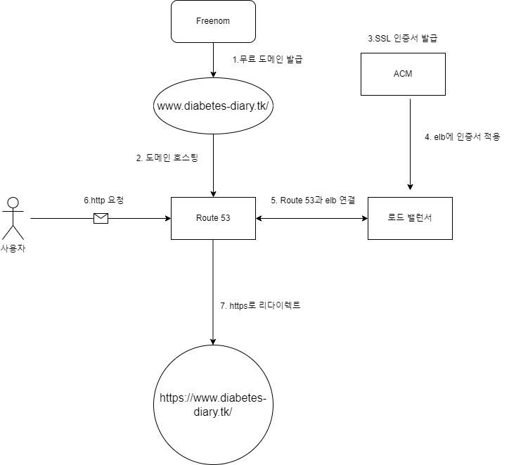
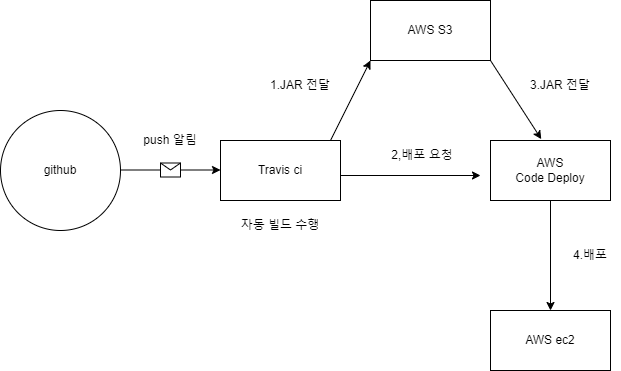

# __Diabetes Diary API Remake__

## 버전 : 1.1.0

### 웹 사이트 주소 ###

https://www.diabetes-diary.tk/

### 블로그 주소

https://velog.io/@dasd412/series/%ED%8F%AC%ED%8A%B8%ED%8F%B4%EB%A6%AC%EC%98%A4
***

### 주요 기능

1. 회원 가입
2. 로그인 (form login과 OAuth login 방식 모두 제공)
3. 일지 작성 및 수정 / 삭제 기능
4. 달력으로 일지 표시
5. 공복 혈당 / 식사 혈당/ 평균 혈당 관련 차트
6. 음식 검색 게시판
7. 아이디 ,비밀 번호 찾기 (예정)
8. 시큐어 코딩 (예정)
9. 튜토리얼 기능(예정)
***

### API end point

https://github.com/dasd412/RemakeDiabetesDiaryAPI/wiki/API-Endpoint

### 디렉토리 구조

+ Backend
    + https://github.com/dasd412/RemakeDiabetesDiaryAPI/wiki/backend-directory
+ Frontend
    + https://github.com/dasd412/RemakeDiabetesDiaryAPI/wiki/frontend-directory

### 다이어그램

+ ERD
  + 
+ 브라우저 접근 흐름도
  + 
+ 배포 다이어그램
  + 
  
***
  
### 진행 상황 ###

https://github.com/dasd412/RemakeDiabetesDiaryAPI/wiki/progress

### 테스트 커버리지 ###
+ (2022-02-13 전체 패키지 기준)
  + 테스트 총 154개
  + 클래스 커버리지 94% (103/109)
  + 메소드 커버리지 74% (500/671)
  + 라인 커버리지 75% (1583/2101)

+ (2022-02-13 domain 패키지 기준)
  + 테스트 총 86개
  + 클래스 커버리지 100% (22/22)
  + 메소드 커버리지 84% (134/159)
  + 라인 커버리지 86% (502/581)

+ (2022-02-04 controller 패키지 기준)
  + 테스트 총 49개
  + 클래스 커버리지 96% (28/29)
  + 메소드 커버리지 85% (156/182)
  + 라인 커버리지 74% (358/483)

+ (2022-02-13 security 패키지 기준)
  + 테스트 총 19개
  + 클래스 커버리지 93% (30/32)
  + 메소드 커버리지 63% (130/206)
  + 라인 커버리지 64% (385/595)
***

### 개선 사항

+ 복합키의 장점을 못 살렸음.
+ Nginx 무중단 배포 실패. (아마 elb와 충돌한 것 같다.)
+ Travis ci 로그 길이 제한 때문에 -DskipTests를 사용하고 있다. 테스트를 실행하게 할 수 있는 방법이 없을까.

***

### 사용 기술

+ SpringBoot
+ JPA
+ Querydsl
+ MySql
+ Spring Security
+ Junit
+ Mustache, css
+ JQuery 
+ AWS (ec2, route 53, ACM, rds, code deploy )
+ travis ci

### 사용 라이브러리

+ chart.js
+ datepicker.js
+ bootstrap

***

### 본인 작성이 아닌 것.

+ /resources/static/vendor/* [colorLib 저작권 ]
+ /resources/static/sidebar-07/* [colorLib 저작권 ]
+ /resources/static/js/calendar/ (calendar.js ,formatter.js, stringBuffer.js) [구글링 코드]
+ src/main/java/com/dasd412/remake/api/controller/security/domain_view/FoodPageMaker [스타트 스프링 부트]

